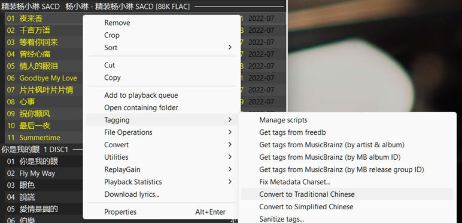
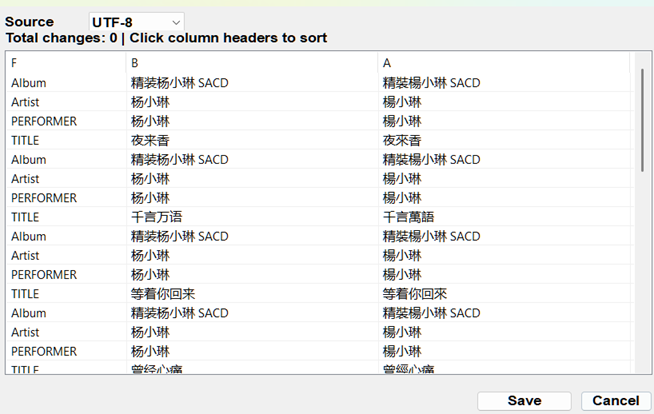

# Chinese Character Converter for foobar2000

A foobar2000 v2.1+ component that converts music metadata between Simplified and Traditional Chinese characters.

## Installation

### For 32-bit foobar2000
Download: `foo_chinese_converter-v1.0.0-x86.fb2k-component`

### For 64-bit foobar2000
Download: `foo_chinese_converter-v1.0.0-x64.fb2k-component`

**Installation Methods:**
1. **Easiest**: Drag the `.fb2k-component` file into the foobar2000 window
2. **Manual**: Extract to `%APPDATA%\foobar2000\profile\user-components\` and restart

## Usage

1. Open Metadata Editor (Ctrl+E) in foobar2000
2. Select one or more tracks
3. Right-click any metadata field
4. Navigate to: **Tagging → Convert to Traditional Chinese** (or Simplified)
5. Review the conversion preview
6. Save your changes

### See It In Action

*Right-click context menu showing conversion options*

*Before/after tag conversion preview showing actual transformations*

## Features

- ✅ Bidirectional conversion: Simplified ↔ Traditional Chinese
- ✅ Works on any metadata field (artist, album, title, etc.)
- ✅ Non-blocking async operations (UI stays responsive)
- ✅ Batch operations (convert multiple tracks at once)
- ✅ Multiple Traditional Chinese variants (Taiwan, Hong Kong, etc.)
- ✅ Both x86 and x64 builds included

## Requirements

- foobar2000 v2.1 or later
- Windows XP SP3 or later
- ~1 MB disk space

## Technical Details

- Built with the official foobar2000 SDK
- Uses OpenCC library for accurate character conversion
- Written in C++ for performance
- Architecture-specific builds (x86 and x64)

## Downloads

All releases are available on the [GitHub Releases page](https://github.com/wmtang2/FB2K-Chinese/releases).

## Issues and Feedback

Found a bug? Have a feature request? Please open an [issue](https://github.com/wmtang2/FB2K-Chinese/issues).

## License

[Specify your license here]

---

**Version:** 1.0.0  
**Last Updated:** November 11, 2025
